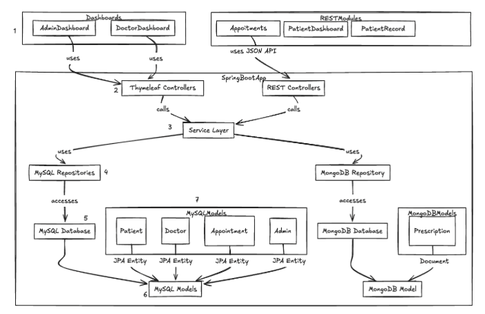

# Diseño de Arquitectura del Sistema Smart Clinic

## Sección 1: Resumen de la arquitectura

La aplicación **Smart Clinic** está desarrollada con **Spring Boot** y sigue una arquitectura de tres capas: presentación, aplicación y datos. Utiliza **controladores MVC** junto con **controladores REST**, permitiendo una combinación de vistas renderizadas en el servidor (usando Thymeleaf para los paneles de administración y médicos) y servicios REST para los módulos que requieren mayor interoperabilidad, como citas y registros de pacientes.

El sistema interactúa con **dos bases de datos distintas**:
- **MySQL** se utiliza para datos relacionales estructurados (pacientes, doctores, citas, administradores), gestionados mediante **Spring Data JPA**.
- **MongoDB** almacena datos más flexibles y no estructurados, como recetas médicas, a través de **Spring Data MongoDB**.

La lógica de negocio está centralizada en una **capa de servicio** común que sirve tanto a controladores MVC como REST, y esta capa delega las operaciones de persistencia a los **repositorios** específicos de cada base de datos. Los datos recuperados se mapean en modelos de Java: entidades JPA para MySQL y documentos para MongoDB. Esto garantiza una separación de responsabilidades clara, escalabilidad y facilidad de mantenimiento.

_A continuación, insertá aquí el diagrama de arquitectura:_  

---

## Sección 2: Flujo numerado de datos y control

1. **Interacción del usuario con la interfaz**  
   El usuario accede a la aplicación a través de vistas Thymeleaf (como `AdminDashboard` o `DoctorDashboard`) o mediante clientes REST (como `Appointments`, `PatientDashboard` o `PatientRecord`) que interactúan con el backend a través de HTTP.

2. **Enrutamiento a controladores**  
   Las acciones del usuario son captadas por los controladores apropiados:
    - MVC Controllers devuelven vistas `.html` procesadas por Thymeleaf.
    - REST Controllers procesan solicitudes y devuelven respuestas JSON.

3. **Llamada a la capa de servicio**  
   Los controladores delegan la lógica de negocio a la **capa de servicio**, donde se aplican reglas, validaciones y se coordinan procesos como validaciones de disponibilidad de doctores o control de conflictos de agenda.

4. **Acceso a los repositorios**  
   La capa de servicio consulta o modifica los datos a través de los **repositorios** adecuados:
    - Repositorios JPA para entidades MySQL (pacientes, citas, doctores).
    - Repositorios MongoDB para documentos como recetas.

5. **Conexión con bases de datos**  
   Los repositorios interactúan directamente con las bases de datos:
    - **MySQL** proporciona integridad y relaciones entre entidades.
    - **MongoDB** permite estructuras más flexibles y dinámicas.

6. **Mapeo de datos a modelos**  
   Los datos obtenidos se vinculan con clases de modelo:
    - Entidades JPA (`@Entity`) para MySQL.
    - Documentos (`@Document`) para MongoDB.

7. **Respuesta al cliente**  
   Finalmente, los modelos se utilizan para construir la respuesta:
    - En flujos MVC, se integran en las vistas Thymeleaf.
    - En flujos REST, se serializan como JSON y se envían al cliente.

Este flujo asegura que la aplicación sea modular, extensible y fácil de mantener, permitiendo además la integración con otros sistemas y clientes a través de APIs RESTful.